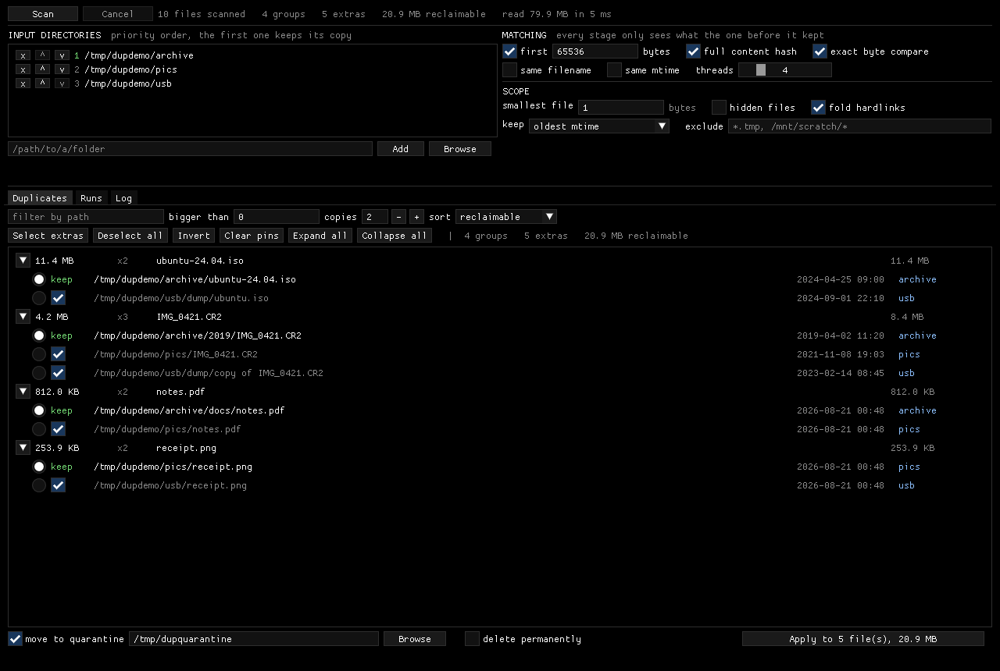

# duplicates-ui-linux

Linux duplicate file finder. A single Dear ImGui window that scans many
directories, groups the files that are byte for byte identical, and removes the
copies you do not want to keep.

</img>

## What it does

- **Inputs**: any number of directories, in a priority order you drag. The copy
  in the highest directory is the one that stays.
- **Matching**: one ordered rule list you build yourself. Glob and regex filters
  in include or exclude mode, size bounds, filename and mtime keys, first N
  bytes, a full content hash, a byte for byte comparison. Every row ticks on and
  off and moves up and down, so cheap filters run first and the expensive proof
  only ever sees what survived.
- **Keepers**: one copy per group is protected and can never be selected. The
  priority order decides which, a tie-break rule settles copies that rank
  equally, and clicking any row's keep dot overrides both for that group.
- **Actions**: move the rest to a quarantine folder, or delete them. Quarantine
  runs are recorded and can be put back with one button.
- **Safety**: nothing is touched until you press Apply and confirm, and every
  file is re-checked against what the scan saw immediately before it is removed.
- **Speed**: hashing runs across threads and results are cached between runs, so
  rescanning an unchanged tree costs almost nothing.
- **A log that says what happened**: the pipeline as it ran, what the walk found
  and skipped, what each row took in and handed on, every hardlink folded, and
  every file moved or deleted with the path it came from.

Scanning `/usr` here, 514,750 files, is 2.7 seconds cold and 2.2 warm, and finds
47,466 groups holding 1.6 GB of duplicated data.

## Install

Grab either artifact from the [latest release](../../releases/latest). Both are
x86_64 and self-contained.

```sh
# AppImage: no install step
chmod +x duplicates-ui-x86_64.AppImage
./duplicates-ui-x86_64.AppImage

# or the plain executable
chmod +x duplicates-ui-x86_64
./duplicates-ui-x86_64
```

Release builds link libstdc++ and libgcc statically and GLFW loads X11 at
runtime, so the only hard requirements are glibc 2.35 or newer and the system's
OpenGL libraries. Nothing external is called at runtime: the hashing and the
file operations all happen in process.

## Build

```sh
cmake -S . -B build -DCMAKE_BUILD_TYPE=Release
cmake --build build -j
./build/duplicates-ui
```

CMake fetches Dear ImGui and GLFW at configure time, so the first build needs
network access. Building GLFW from source needs the X11 development headers
(`sudo apt install xorg-dev` on Debian and Ubuntu).

To reproduce a release build locally, including the AppImage:

```sh
cmake -S . -B build -DCMAKE_BUILD_TYPE=Release -DDUPLICATES_UI_PORTABLE=ON
cmake --build build -j
./packaging/make-appimage.sh build/duplicates-ui dist
```

Pushing a `v*` tag runs the same steps in GitHub Actions and publishes both
artifacts to a release.

## How matching works

One ordered list decides the whole scan. You add rows to it, tick them on and
off, and move them up and down; the row above always runs first.

```
PIPELINE                                        threads [====4====]
      size                                         split   always
[x] ^v x  glob    *.7z                             drop
[x] ^v x  glob    *.zip                            drop
[x] ^v x  glob    *.rar                            drop
[x] ^v x  first bytes   65536 bytes                split
[x] ^v x  full content hash                        split
[x] ^v x  exact byte compare                       split

  [ glob pattern v ]  Add   Reset      patterns [OR v] [INCLUDE v]
```

Two kinds of row live in it:

- **drop** rows look at one file and keep or discard it: glob pattern, regex
  pattern, smallest size, largest size.
- **split** rows need two files to mean anything, and cut the surviving
  candidates into smaller sets: same filename, same mtime, first bytes, full
  content hash, exact byte compare.

They share a list because they commute: throwing a file away never changes
whether two *other* files are copies. That is also why drop rows are applied
during the walk wherever you put them, which costs nothing and lets an excluded
folder be skipped whole.

**Size is not a row.** It always runs first and cannot be moved or removed. It
comes free from the walk's `lstat`, and it is what keeps every row below it
affordable: an exact byte compare with nothing before it would read every file
against every other one.

After every row, any bucket left holding one file is dropped, so each row reads
strictly less than the one before it. On a normal tree **first bytes** is where
almost everything dies: same-size collisions are common, but same size **and**
same first 64 KiB is nearly always a real duplicate.

Three details worth knowing:

- **A file no larger than the head window is hashed in full by the first-bytes
  row**, so it skips the full content hash entirely. On a tree of documents and
  photos that is most files.
- **Exact byte compare is the only row that proves anything.** Turning it off
  means trusting a 64-bit hash with an irreversible delete. It is on by default,
  and it is also why a rescan still reads the candidate files: a cached hash can
  skip the content hash, but nothing can skip a byte comparison.
- **Same filename and same mtime can only ever narrow a result.** They split
  buckets further, so they can hide a real duplicate but never invent one.

A second row of the same kind has nothing left to do, so it is dropped and said
so in the log. Rows you untick never reach the scan at all.

### Pattern rows

Glob and regex rows are the same row wearing a different hat: click the kind
button to switch one to the other. Globs go through `fnmatch`, regexes through
ECMAScript `std::regex`, and both are tried against the whole path **and**
against the filename, so `*.zip` and `/mnt/scratch/*` both do what they look
like they do. A regex that will not build is marked in red as you type it and
skipped at scan time rather than throwing halfway through.

The two boxes under the list describe the pattern rows as a set, which is not a
per-row question:

- **OR** keeps a file if any pattern matches. **AND** only if every one does.
- **INCLUDE** scans only what matches. **EXCLUDE** skips what matches, and skips
  a matching folder whole without walking into it.

With no pattern rows at all, both modes keep everything: "include nothing" is
never what an empty list means. Include mode cannot prune directories, because a
folder name says nothing about whether the files inside it will match.

So the answer to "only look at my archives" is three glob rows, `OR`, `INCLUDE`:

```
[x] glob  *.7z      [x] glob  *.zip      [x] glob  *.rar
```

### Hardlinks

Paths that share a `(dev, ino)` pair are folded into one row before anything is
compared, with the others shown as "also linked at N other paths". They occupy
the disk once, so reporting them as duplicates would offer to reclaim bytes that
do not exist and would cost you a path you wanted. Untick **fold hardlinks** to
treat every linked path as an ordinary, actionable copy.

### What never reaches a group

- Files below the size floor, which is a `smallest size` row set to 1 byte by
  default, so empty files do not form one enormous useless group. Set it to 0,
  or delete the row, if you want them.
- Symlinks. They are never followed, so a link is never mistaken for its target
  and a symlink loop cannot hang the walk.
- Hidden files and dot directories, unless you ask for them. Without this a
  `.git` object store contributes thousands of dull duplicates.
- Anything a pattern row turns away, and everything inside a folder an exclude
  pattern matched.
- Anything outside the size floor or ceiling, if you added those rows.
- Anything unreadable. It is logged and dropped, so it can never be deleted.

Input directories that overlap are folded together before the walk, so no file
is scanned or reported twice.

## Priority and keepers

The input list is the priority order: first wins. Within one directory, or
between two that rank equally, the **keep** rule decides: oldest mtime by
default, or newest, shortest path, fewest path segments, or alphabetical.

Clicking a row's keep dot pins that group. Later changes to the order or the
rule leave pinned groups alone, and **Clear pins** puts them all back under the
rules. Whenever the keeper changes, the copy that lost the job becomes
selectable and the new one is protected, so exactly one copy per group is always
safe.

## Applying

Pick **move to quarantine** or **delete permanently**. They are mutually
exclusive, because a destructive run has to have one unambiguous meaning.

A quarantined file keeps its original absolute path under the quarantine folder,
so `/home/you/a.txt` lands at `<quarantine>/home/you/a.txt` and two files with
the same name cannot collide. If something is already at that path, ` (2)` is
appended rather than anything being overwritten.

Before each file is touched, both it and the copy that is supposed to survive
are re-checked against the size and mtime the scan recorded. Anything that moved
in the meantime fails that row with a reason, and nothing is removed. A failed
row does not stop the run.

The quarantine folder cannot be inside a directory being scanned, since that
would re-import everything on the next scan.

## Runs and restore

Every run writes a manifest, and the line for each file is flushed **before**
that file is touched, so a crash can leave a file recorded but not moved, never
a file moved with no record of where it came from.

- Quarantine manifests live at `<quarantine>/.duplicates-ui/run-<stamp>.tsv`,
  next to the files they describe.
- Delete manifests live at `$XDG_STATE_HOME/duplicates-ui/runs/`. They are a
  record, not an undo: a delete cannot be reversed.

The **Runs** tab lists past runs newest first. Restore moves every file in a
quarantine run back to its original path, creating directories as needed and
skipping any path that has since been reoccupied rather than overwriting it.

## The log

The **Log** tab is the running commentary of the session, not just its errors.
Each line is stamped and levelled, and the three tick boxes filter by level:

```
01:30:39 scan started: 1 input directory
01:30:39   1. /mnt/photos
01:30:39 pipeline: size, at least 1 B, *.zip or *.rar (include), first 65536 bytes, exact byte compare
01:30:39 scope: hidden files skipped, hardlinks folded, keeping the oldest mtime on a tie, 4 hash thread(s)
01:30:39 walk finished: 7 file(s), 976.6 KB, in 0 ms
01:30:39 skipped: 0 hidden, 0 below the floor, 0 above the ceiling, 0 symlink(s), 2 filtered out, ...
01:30:39 folded hardlink: /mnt/photos/a/movie.zip -> /mnt/photos/b/movie.zip
01:30:39 size: 6 in -> 6 candidates
01:30:39 first 64.0 KB: 6 in -> 6 candidates
01:30:39 exact byte compare: 6 in -> 6 candidates
01:30:39 scan finished: 3 group(s), 3 extra(s), 390.6 KB reclaimable, read 1.1 MB in 2 ms, 0 error(s)
01:30:43 quarantine run started: 3 file(s), 390.6 KB -> /mnt/quarantine
01:30:43 moved: /mnt/photos/b/movie.zip -> /mnt/quarantine/mnt/photos/b/movie.zip  (195.3 KB, keeping /mnt/photos/a/movie.zip)
01:30:43 quarantine run finished: 3 done, 0 failed, 390.6 KB reclaimed
```

Every file that is moved, deleted or restored is named with the path it came
from, and a rule that could not be built is reported rather than quietly
dropped. The buffer is a rolling window; when lines scroll off the top the tab
says how many, because a truncated log that looks complete is worse than none.
The permanent record is the run manifest.

**Double click** any input directory, or any path in a duplicate group, to open
it in your file manager (`xdg-open`). Single click on an input row is reserved
for dragging it, which is how priority is reordered.

## State on disk

- `$XDG_STATE_HOME/duplicates-ui/session.tsv` holds the inputs and their order,
  the rule list in its exact order, the pattern modes, the scope toggles, the
  tie-break, the quarantine folder and the view. Written only when it changes,
  and through a temporary file so a crash cannot truncate it. A `v1` file from
  before the rule list is still read: its fixed cascade and exclude globs are
  turned into the equivalent rows, so upgrading loses nothing.
- `$XDG_CACHE_HOME/duplicates-ui/hashes.tsv` maps `(device, inode, size, mtime)`
  to a content hash. A file that has been touched simply misses and is
  recomputed, so there is no invalidation logic to get wrong. Deleting it costs
  time and nothing else.

Scan results are deliberately not saved. They are large, they go stale the
moment anything on disk changes, and rescanning with a warm cache is fast.

## Testing

```sh
./build/unit-tests          # the cascade, keepers, quarantine and restore
./tools/smoke-test.sh out   # proves the window opens and paints a frame
```

`tools/headless-run.sh` drives the app on a private Xvfb display, so a UI change
can be checked without a window appearing on your desktop and without a desktop
session at all. It takes a script of clicks, keys and screenshots:

```sh
cat > /tmp/run.txt <<'EOF'
click 240 190
type /mnt/archive
click 505 190
click 54 17
wait 3
shot scanned
EOF
./tools/headless-run.sh /tmp/out /tmp/run.txt
```

There is no window manager on that display, so the window sits at 0,0 with no
title bar and screenshot coordinates map straight to click coordinates.

The unit tests build a fixture tree in a temporary directory covering identical
files across and within directories, files sharing a head but not a tail, files
sharing only a size, hardlinks, empty files and symlinks, then check the whole
cascade against it. They also run a real quarantine and restore. The one thing
they cannot cover is the cross-device move: `rename` only fails with `EXDEV`
when two filesystems are actually involved, so quarantining to a different disk
is worth trying by hand once.

## Notes

- Hashing is xxHash64, implemented in `src/hash.cpp` rather than fetched. It is
  under a hundred lines and the disk is the bottleneck at every size this reads.
- Threads default to 4. That is a large win on an SSD and a loss on a single
  spinning disk, which is why it is a visible control.
- Memory is bounded by the file count, not by their size: roughly 200 bytes per
  file, so a million files is about 200 MB.
- The results list only draws the rows on screen, so a hundred thousand groups
  scroll for the same cost as ten.
